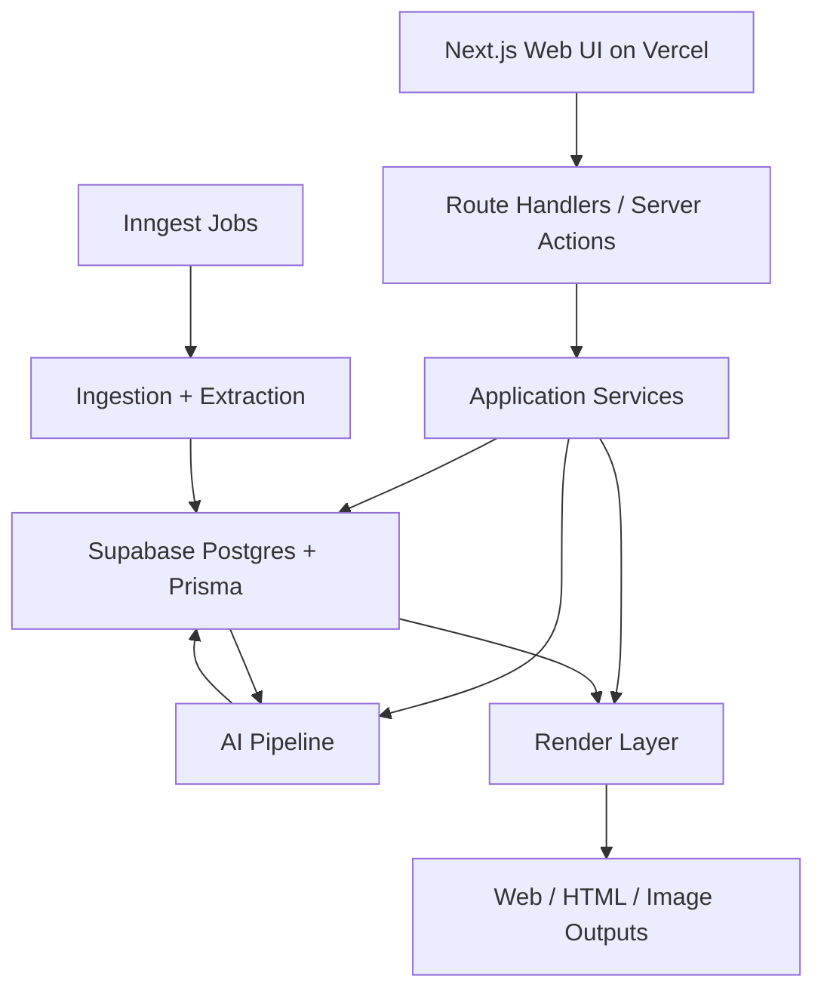

# Technology Stack Blueprint

Date: 2026-05-21
Project: Inflowee
Output Type: Recommended implementation blueprint based on product spec

## 1. Current State

The current repository does not contain an existing application stack.

Detected assets:

- Product spec at
  [2026-05-21-ai-powered-information-hub-design.md](/Users/lee/workspaces/ai/Inflowee/docs/superpowers/specs/2026-05-21-ai-powered-information-hub-design.md)

Not detected:

- `package.json`
- app source code
- backend service
- database schema
- background execution setup
- test setup
- CI configuration

This blueprint is therefore a proposed implementation stack, not a reverse
engineered description of an existing codebase.

## 2. Product Constraints Driving the Stack

The stack needs to support:

- Web app for inbox, spaces, tasks, source management, and chat
- Public-web ingestion from heterogeneous source types
- AI processing pipeline for recommendation, enrichment, and brief generation
- Structured list extraction for pages like `remotejobscn.com`
- Canonical brief storage with multiple render targets
- HTML and image output rendering
- Incremental implementation in thin vertical slices

The MVP does not need:

- Multi-service microservice architecture
- Full workflow engine
- Social API integrations
- Mailbox ingestion
- Team collaboration infrastructure

## 3. Recommended Stack

### 3.1 Application Shape

Use a single TypeScript codebase with three cloud-friendly execution surfaces:

- `Next.js` web app for UI and server endpoints
- managed background jobs for crawling and AI tasks
- shared domain package for schemas and core business logic

This is the fastest path to a deployable MVP without taking on self-managed
worker infrastructure.

### 3.2 Frontend

- `Next.js` App Router
- `React`
- `TypeScript`
- `Tailwind CSS`
- `shadcn/ui` for pragmatic primitives, not as a visual identity
- `Vercel` for deployment

Reasons:

- Fast route scaffolding for inbox, task, and source surfaces
- Server components and route handlers reduce early boilerplate
- Strong TypeScript coverage across UI and backend
- Easy path to richer rendering for HTML output previews
- Preview and production deployment are immediate

### 3.3 Backend and API

- `Next.js` Route Handlers for MVP APIs
- `Zod` for request and domain validation
- Server-side TypeScript modules for application services

Reasons:

- Keeps app and API in one deployable unit
- Good enough for MVP CRUD, chat, source management, and render endpoints
- Avoids setting up a second backend framework before real scale demands it

Boundary:

- Do not introduce GraphQL in MVP
- Do not split a dedicated API server unless ingestion and interactive traffic
  clearly diverge

### 3.4 Database

- `Supabase Postgres`
- `Prisma`

Reasons:

- The product has relational core entities: spaces, tasks, sources, items,
  briefs, chat threads
- JSON fields are still useful for task profiles, extraction configs, and
  structured fields
- Managed PostgreSQL is a safer default than SQLite here because ingestion,
  chat, and background writes will quickly create concurrent write pressure
- Supabase removes early operational work around hosting, backups, and admin
- Prisma keeps the first implementation pass fast and explicit

Boundary:

- Use straightforward Prisma models first
- Do not build repository abstractions until there is real duplication

### 3.5 Background Jobs and Scheduling

- `Inngest` for asynchronous jobs and schedules
- Job metadata stored in Postgres

Reasons:

- Crawling, enrichment, and brief generation are asynchronous
- Serverless web deployments are a poor fit for self-managed long-running
  workers
- Inngest works well with Next.js and removes queue and worker infrastructure
- This is materially faster to ship in a cloud environment

Boundary:

- Do not add Redis and BullMQ in the first slice
- Do not self-host a custom worker unless scale or cost later justifies it

### 3.6 Fetching and Extraction

- Native `fetch` for straightforward pages and feed retrieval
- `Cheerio` for HTML parsing
- `Playwright` only as a fallback for JS-heavy pages or extraction verification
- `rss-parser` or equivalent feed parser for RSS/Atom ingestion
- `JSDOM` only if a page-specific case needs lightweight DOM semantics

Reasons:

- Most MVP sources should be handled without a browser runtime
- Playwright is useful, but making it the default crawler would add cost and
  operational friction too early
- Browser-based extraction should run only in background jobs, never in the
  user request path

Source handling guidance:

- `RSSSource`: parse feed entries directly
- `PageSource`: fetch page and extract primary content or listing links
- `StructuredListSource`: fetch page and apply structured field extraction
- `UpdateSource`: detect incremental updates on a recurring page
- `NewsletterArchiveSource`: treat archive entries as recurring public posts

### 3.7 AI Layer

- OpenAI API for MVP
- Shared prompt orchestration module in the app codebase
- Structured output contracts validated with `Zod`

Reasons:

- The product depends on repeatable structured outputs more than on free-form
  generation
- Task understanding, bundle recommendation, item enrichment, and brief
  generation all benefit from validated typed outputs

AI implementation rules:

- Every AI stage returns typed JSON-shaped data before persistence
- Prompts should be stage-specific, not one giant agent workflow
- Keep live-fetch chat augmentation as a separate step, not baked into every
  answer

### 3.8 Rendering Layer

- React-based HTML templates rendered server-side
- `satori` plus `resvg` for image card generation

Reasons:

- Reuse one component language across web and output rendering
- Image card generation needs deterministic rendering, not screenshot hacks

Boundary:

- Only support single-brief static image cards in MVP
- No free-form visual editor

### 3.9 Authentication

- Single-user local-first development mode initially
- Add auth only when the product moves from prototype to hosted user access

Reason:

- Auth is not part of the validated MVP loop yet
- Adding it before source ingestion and brief quality is solved is wasted scope

If hosted access is required early:

- Use `Supabase Auth` or `NextAuth`

### 3.10 Testing

- `Vitest` for unit and service tests
- `Playwright` for end-to-end browser tests
- Lightweight integration tests against a test database

Coverage priorities:

- Source normalization
- structured list extraction
- dedupe clustering behavior
- brief generation contracts
- task and source CRUD flows

### 3.11 Tooling

- `pnpm` as package manager
- ESLint
- Prettier
- TypeScript strict mode

Reasons:

- Fast install and workspace support if the repo grows
- Predictable formatting and validation from the first slice

### 3.12 Cloud Deployment

- `Vercel` for the web app and route handlers
- `Supabase` for managed Postgres
- `Inngest` for async execution and scheduling

Reasons:

- This is the fastest credible path from local dev to public deployment
- Preview environments come naturally from the web deployment workflow
- Managed async execution fits ingestion and AI jobs better than a custom worker

## 4. Recommended Code Organization

Use a single app repo with clear boundaries:

```text
src/
  app/
    (routes and UI)
  components/
    (UI components only)
  server/
    api/
    services/
    inngest/
    ingest/
    ai/
    render/
  lib/
    db/
    schemas/
    utils/
  tests/
```

Responsibility rules:

- `app/`: route composition and page-level data loading
- `components/`: presentational or interaction-focused UI
- `server/services/`: task, source, brief, and chat business logic
- `server/inngest/`: scheduled and queued execution definitions
- `server/ingest/`: source-type-specific fetch and extraction code
- `server/ai/`: prompts, response parsing, and AI stage orchestration
- `server/render/`: HTML and image output generation
- `lib/schemas/`: shared `Zod` contracts and domain types

## 5. Architecture Diagram



## 6. Key Implementation Patterns

### 6.1 Domain-First Contracts

Define `Zod` schemas for:

- `TaskInput`
- `SourceInput`
- `BundleCandidate`
- `NormalizedItem`
- `BriefOutput`

Reason:

- These contracts are the seam between UI, API, AI, and async execution

### 6.2 Source-Type Adapters

Use one adapter per source type:

- `ingest/rss.ts`
- `ingest/page.ts`
- `ingest/structured-list.ts`
- `ingest/update.ts`
- `ingest/newsletter-archive.ts`

Reason:

- Each source type has different fetch and extraction semantics
- This keeps failures isolated and testable

### 6.3 Small AI Stages

Keep AI calls isolated by purpose:

- `understandTaskIntent`
- `recommendSourceBundles`
- `enrichItem`
- `generateBriefs`

Reason:

- Easier testing
- Easier prompt tuning
- Easier fallback behavior

### 6.4 Deterministic Renderers

Rendering should consume `Brief` data, not re-run AI.

Reason:

- Output format should not change meaning
- HTML and image rendering need stable, repeatable results

## 7. First Implementation Slices

The right first slice is not crawling. The right first slice is the minimum
domain and UI path that proves the product shape.

### Slice 1

Implement:

- app shell
- database schema for `Space` and `Task`
- create/list UI for spaces and tasks
- basic validation

Verify:

- user can create a space
- user can create a task inside a space
- data persists

### Slice 2

Implement:

- `Source` schema
- source CRUD UI
- source type selection
- manual source entry

Verify:

- task can own multiple typed sources

### Slice 3

Implement:

- Inngest job wiring
- RSS ingestion path
- item persistence

Verify:

- a real RSS source produces stored items

### Slice 4

Implement:

- AI task understanding
- source bundle recommendation UI

Verify:

- user can create a task prompt and receive source bundles

### Slice 5

Implement:

- item enrichment
- brief generation
- inbox UI

Verify:

- ingested items become viewable briefs

### Slice 6

Implement:

- structured list source extraction
- first non-RSS source validation

Verify:

- a list page like a job board yields normalized items

### Slice 7

Implement:

- HTML digest renderer
- image card renderer

Verify:

- one brief can render as HTML and image output

## 8. Conventions

### Naming

- React components: `PascalCase`
- service modules: `kebab-case` filenames with named exports
- database models: singular `PascalCase`
- validation schemas: `<DomainName>Schema`

### Error Handling

- Validate at boundaries with `Zod`
- Return typed application errors from services
- Keep raw fetch or AI errors visible in source or job status records

### Data Access

- All DB access goes through service-layer functions or ingest modules
- Do not query Prisma directly from UI routes except in thin server loaders

### Testing

- Unit test pure transforms first
- Integration test service flows second
- End-to-end test one happy path per vertical slice

## 9. Technology Decision Context

Why not SQLite:

- The product is write-heavy once ingestion starts
- Background jobs and interactive requests will compete for writes

Why not microservices:

- MVP complexity is in product logic, not service decomposition

Why not browser-first crawling:

- Too expensive and slow as a default
- Most sources can be handled through HTTP plus HTML parsing

Why not self-managed worker first:

- Slower to ship on cloud platforms
- Adds process supervision and retry infrastructure too early

Why not generic workflow engine:

- There is no evidence yet that the MVP needs arbitrary flow composition

## 10. Implementation Checklist

- Initialize `Next.js + TypeScript + pnpm`
- Add Prisma and Supabase Postgres connection
- Enable strict TypeScript, ESLint, and Prettier
- Create `Space` and `Task` models
- Build first CRUD slice
- Add `Source` models and source-type adapters
- Add Inngest functions and schedules
- Add RSS ingestion
- Add AI stage contracts
- Add inbox and brief rendering
- Add HTML and image outputs

## 11. Final Recommendation

Use:

- `Next.js + React + TypeScript` on `Vercel`
- `Supabase Postgres + Prisma`
- `pnpm`
- `Tailwind CSS`
- `Zod`
- `Vitest`
- `Playwright`
- `Cheerio`
- `Inngest`
- `OpenAI API`
- `satori/resvg`

Avoid in MVP:

- microservices
- Redis queue by default
- GraphQL
- mailbox ingestion
- social platform integrations
- rule-engine-first configuration

This stack is conservative, fits the validated spec, and supports incremental
implementation while keeping deployment fast and cloud-friendly.
